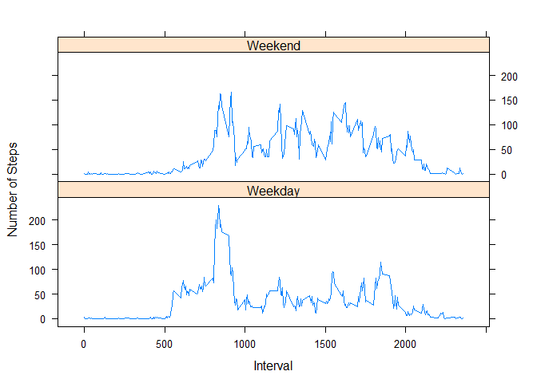

# Reproducible Research: Peer Assessment 1


## Loading and preprocessing the data

This section shows how the data was loaded and processed.


```r
options(stringsAsFactors = FALSE)
if(!file.exists('./data'))  
      dir.create('./data/')
if(!file.exists('./data/activity.csv'))
      unzip('activity.zip', exdir = 'data')
df <- read.csv('./data/activity.csv')
```

Processing the data requires that we convert df$date to a date format recognized by R.  The  code below converts data to a format useable by R.


```r
df$date <- as.Date(df$date)
```

## What is mean total number of steps taken per day?

In order to calculate the mean total number of steps taken per day I will need to reshape the data.  This can be achieved using the package **reshape2**.


This first chunk of code calculates the total number of steps taken each day

```r
require(reshape2)
```

```
## Loading required package: reshape2
```

```r
df2 <- melt(df, id = c('date', 'interval'), measure.vars = 'steps')
dailytotal <- dcast(df2, date ~ variable, sum)
```

In the next code chunk, we will take the daily total number of steps taken and create a histogram plot of this data.

```r
hist(dailytotal$steps, xlab = 'Steps per Day', main = '')
```

 

The **mean** and **median** number of steps taken daily are **10766.19** and **10765**, respectively.

## What is the average daily activity pattern?

In order to average number of steps taken for each 5-minute interval averaged across all days, the following code chuck was used.

```r
df2 <- melt(df, id = c('interval', 'date'), measure.vars = 'steps', na.rm = TRUE)
intervalmean <- dcast(df2, interval ~ variable, mean)
```

The plot below shows the average number of steps taken in any single 5-minute interval averaged over all the days in the dataset.


```r
plot(intervalmean$interval, intervalmean$steps, type = 'l', xlab = '5-minute Intervals', 
     ylab = 'Average Number of Steps')
```

 


The interval with the average maximum number of steps is 835.

## Imputing missing values

In order to calculate the total number of rows of missing data the follow code chunk is used.

```r
totalNAs <- sum(is.na(df$steps))
```
The total number of NAs in the data set is 2304.

We plan to fill in all the missing data in an unsophisticated way.  In order to do this, we will take the average computed early for each interval and replace the missing value with the value of the average for that same interval.  In order to do this, the following code chunk is used.

```r
missingvalues <- which(is.na(df$steps))
df3 <- df
for (i in missingvalues){
      interval <- df3$interval[i]
      intervalmean.row <- which(intervalmean$interval == interval)
      df3$steps[i] <- intervalmean$steps[intervalmean.row]
}
```

The new dataset which replaces the missing values with the average calculated above for the specified intervals is depicted in a histogram below.

```r
df4 <- melt(df3, id = c('date', 'interval'), measure.vars = 'steps')
newdailytotal <- dcast(df4, date ~ variable, sum)
hist(newdailytotal$steps, xlab = 'Steps per Day', main = '')
```

 

The **mean** and **median** number of steps taken daily for the manipulated data are **10766.19** and **10766.19**, respectively.

The mean does not change, but the median has changed to the mean.

This does not appear to have any significant affect on the data.  Since some values are replaced by average values, the mean remains the same.  However, the median value changes to reflect the new values entered.


## Are there differences in activity patterns between weekdays and weekends?

As the final step in this analysis we will plot the average daily steps taken in each interval for weekdays and weekends separately.  This analysis uses the data with NA values replaces.  In the code chunk below, a factor variable is created that indicates if the day is a weekday or weekend.  This information is then plotted below.


```r
df3$day <- weekdays(df3$date)
df3$weekday.end <- sapply(df3$day, function(x){
      if(x == 'Saturday' | x == 'Sunday'){
            return('Weekend')
            } else
                  return('Weekday')
      
      }
      )
df3$day <- NULL

df4 <- melt(df3, id = c('interval', 'date', 'weekday.end'), measure.vars = 'steps', na.rm = TRUE)
intervalmean.weekday.end <- dcast(df4, interval + weekday.end ~ variable, mean)
intervalmean.weekday.end$weekday.end <- factor(intervalmean.weekday.end$weekday.end)

require(lattice)
```

```
## Loading required package: lattice
```

```r
xyplot(intervalmean.weekday.end$steps ~ intervalmean.weekday.end$interval | 
             intervalmean.weekday.end$weekday.end, type = 'l', 
       layout = c(1,2), ylab = 'Number of Steps', xlab = 'Interval')
```

 
